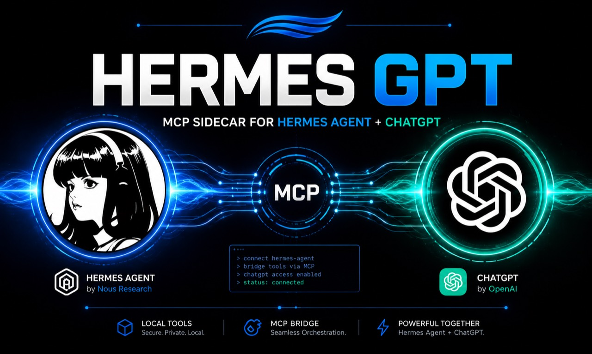

# hermes-gpt



`hermes-gpt` is a standalone MCP sidecar for Hermes Agent. It imports selected local Hermes Agent internals at runtime and exposes them to MCP clients without modifying Hermes Agent source files.

This is a **local-dev release**. It is not a hosted service, not a fork of Hermes Agent, not a generic remote dev container, and not a replacement for DevSpace.

## Security posture

By default, `hermes-gpt` is designed for a trusted local machine:

- HTTP binds to `127.0.0.1` by default.
- Tools advertise `noauth` only for local-dev MCP clients.
- Write, patch, terminal execution, memory writes, and session search are disabled or hidden by default.
- Remote/public release is not supported until real OAuth or another ChatGPT-compatible authentication layer is added.

Do not expose this server publicly without authentication. A temporary tunnel is acceptable only for short local testing when you understand that any enabled tool is reachable through that URL.

## Prerequisites

- Python 3.10+
- A local Hermes Agent install
- MCP Python SDK and Uvicorn

Install dependencies:

```bash
cd ~/hermes-gpt
python -m pip install -r requirements.txt
```

## Local MCP clients

Stdio mode is for local MCP clients that support subprocess MCP servers:

```bash
cd ~/hermes-gpt
python server.py
```

Example client command:

```json
{
  "command": "python",
  "args": ["C:\\Users\\asimo\\hermes-gpt\\server.py"]
}
```

## Local HTTP

HTTP mode uses FastMCP streamable HTTP:

```bash
cd ~/hermes-gpt
python server.py --http --host 127.0.0.1 --port 7677
```

Local endpoint:

```text
http://127.0.0.1:7677/mcp
```

If you bind to anything other than loopback in the default `local-dev` profile, the server prints a warning. This warning means the configuration is not release-safe.

## ChatGPT local testing

ChatGPT developer mode expects a remote MCP endpoint. Do not enter a localhost URL such as `http://127.0.0.1:4750`; ChatGPT fetches the MCP configuration through its connector path, where `127.0.0.1` is not your machine.

For short local testing only:

```powershell
cd C:\Users\asimo\hermes-gpt
python server.py --http --host 127.0.0.1 --port 4750
```

In another terminal:

```powershell
& "C:\Program Files (x86)\cloudflared\cloudflared.exe" tunnel --url http://127.0.0.1:4750 --http-host-header 127.0.0.1:4750
```

In ChatGPT, configure:

- Protocol: Streaming HTTP
- MCP server URL: `https://<your-trycloudflare-host>/mcp`
- Authentication: No Authentication

This is not a production deployment. Remove and recreate the connector if ChatGPT cached older tool metadata.

## Tool gates

Default visible tools:

- `hermes_read_file(path, offset=1, limit=500)`
- `hermes_search_files(pattern, target="content", path=".", file_glob=None, limit=50)`
- `hermes_memory(action="search", target="memory", content=None, old_text=None)`
- `hermes_skill_list()`
- `hermes_skill_view(name)`

Opt-in tools and actions:

| Capability | Env var | Default |
| --- | --- | --- |
| Write file and patch tools | `HERMES_GPT_ENABLE_WRITE=1` | Hidden |
| Memory `add`, `replace`, `remove` | `HERMES_GPT_ENABLE_MEMORY_WRITE=1` | Disabled |
| Session search | `HERMES_GPT_ENABLE_SESSION_SEARCH=1` | Hidden |
| Terminal command execution | `HERMES_GPT_ENABLE_TERMINAL=1` | Hidden |

Terminal timeout is capped at 120 seconds even when enabled.

The broad `HERMES_GPT_ENABLE_*` flags still work for backward compatibility,
but for tiered, safe operation prefer the **Operator / Owner Mode** tools
documented below.

## Hermes GPT Operator Mode

Operator / Owner Mode is a tiered control plane that lets trusted MCP
clients (like ChatGPT) operate Hermes safely: cron jobs, skills, profile
config wiring, safe non-secret env keys, gateway/runtime status and restart,
scoped workspace edits, and (with explicit acknowledgement) owner-level
command and file access.

### Safety model

- **Default behavior is read-only.** Mutating operator tools refuse unless
  operator mode is explicitly enabled.
- **Dry-run is the default.** Even when operator mode is enabled, every
  mutating tool defaults to `dry_run=True` and returns a plan instead of
  mutating. To actually mutate, you must set
  `HERMES_GPT_OPERATOR_APPLY_MODE=direct` AND pass `dry_run=False` to the
  tool call.
- **Direct mutation requires explicit opt-in.** `HERMES_GPT_OPERATOR_APPLY_MODE=direct`
  is required for any write to happen.
- **Owner Mode requires an additional explicit acknowledgement.** Setting
  `HERMES_GPT_OPERATOR_LEVEL=owner` alone is not enough; you must also set
  `HERMES_GPT_OWNER_ACK=I_UNDERSTAND_THIS_CAN_MUTATE_MY_MACHINE`. Without
  the exact ack string, owner tools refuse.
- **No secrets exposed.** Config `get` redacts secret-looking keys; `env`
  tools never return values; skill/cron prompts are logged and surfaced
  only as `prompt_len` + `prompt_sha256`.
- **No `.env` raw read/write.** The denied-path policy refuses `.env`,
  `auth.json`, `mcp-tokens/`, `.ssh/`, `.aws/`, `vault/`, and any
  secret-looking filename.
- **No `shell=True` anywhere.** Every subprocess invocation uses
  `shell=False` with a fixed argv.
- **No `git add -A`, no `git push`, no destructive filesystem operations.**
  Workspace `run_test` only allows a conservative allowlist (pytest, ruff,
  mypy, npm test/lint, git status/diff). Owner `run_command` blocks
  catastrophic patterns (`rm -rf /`, `del /s`, `format`, `curl | bash`,
  `git push --force`, `git add -A`, `git add .`, anything touching
  `.env`/`vault`/`token`/`.ssh`).
- **Operator Mode is not a sandbox.** Use OS-level isolation (container,
  VM, or a tool like OpenShell) for untrusted input. The operator gates
  are defense-in-depth, not a security boundary — same stance as Hermes
  Agent's own SECURITY.md.
- **Do not expose remote without real auth.** Operator Mode does not add
  any authentication. Bind to loopback only, or put a real auth layer
  (VPN, Tailscale, OAuth) in front before exposing on a network.

### Operator levels

Levels are ordered; each level includes all capabilities of the levels
above it in this list.

| Level | Capabilities |
| --- | --- |
| `read_only` | status, policy, audit tail, cron list/status, skill diff/list/view, config get, env status, gateway status, git status/diff |
| `cron` | + cron run, cron pause, cron copy, cron move |
| `skills` | + skill create, edit, patch, write_file, copy, sync_to_default, delete |
| `skills_config` | + config set/patch, env set/copy (non-secret keys only) |
| `workspace` | + scoped workspace patch/write, test/lint allowlist, gateway restart |
| `owner` | + raw command, raw file patch/write — still gated by explicit owner ack and still denies secret paths |

### Env flags

| Env var | Default | Purpose |
| --- | --- | --- |
| `HERMES_GPT_OPERATOR_ENABLED` | unset (false) | Enable operator mode |
| `HERMES_GPT_OPERATOR_LEVEL` | `read_only` | Operator level (see table above) |
| `HERMES_GPT_OPERATOR_APPLY_MODE` | `dry_run` | `dry_run` returns plans; `direct` allows mutation |
| `HERMES_GPT_OPERATOR_ALLOWED_PROFILES` | `default` | Comma-separated profile names, or `*` for all existing |
| `HERMES_GPT_OPERATOR_ALLOWED_PATHS` | empty | Comma-separated workspace root paths; empty disables workspace writes |
| `HERMES_GPT_OPERATOR_DENIED_PATHS` | built-in defaults | Extra denied paths (additions only; cannot weaken defaults) |
| `HERMES_GPT_OWNER_ACK` | unset | Must equal `I_UNDERSTAND_THIS_CAN_MUTATE_MY_MACHINE` for owner tools |

### Examples

Read-only default (no env vars needed):

```powershell
hermes-gpt
```

Cron dry-run:

```powershell
$env:HERMES_GPT_OPERATOR_ENABLED="1"
$env:HERMES_GPT_OPERATOR_LEVEL="cron"
$env:HERMES_GPT_OPERATOR_APPLY_MODE="dry_run"
$env:HERMES_GPT_OPERATOR_ALLOWED_PROFILES="default,hermes-researcher"
hermes-gpt
```

Skills/config dry-run:

```powershell
$env:HERMES_GPT_OPERATOR_ENABLED="1"
$env:HERMES_GPT_OPERATOR_LEVEL="skills_config"
$env:HERMES_GPT_OPERATOR_APPLY_MODE="dry_run"
$env:HERMES_GPT_OPERATOR_ALLOWED_PROFILES="default,hermes-researcher,hermes-trt-manager,hermes-nexus-wiki"
hermes-gpt
```

Workspace direct with allowed path:

```powershell
$env:HERMES_GPT_OPERATOR_ENABLED="1"
$env:HERMES_GPT_OPERATOR_LEVEL="workspace"
$env:HERMES_GPT_OPERATOR_APPLY_MODE="direct"
$env:HERMES_GPT_OPERATOR_ALLOWED_PATHS="C:\Users\asimo\hermes-gpt,C:\Users\asimo\AppData\Local\hermes\hermes-agent"
hermes-gpt
```

Owner Mode (WARNING: can mutate your machine):

```powershell
$env:HERMES_GPT_OPERATOR_ENABLED="1"
$env:HERMES_GPT_OPERATOR_LEVEL="owner"
$env:HERMES_GPT_OPERATOR_APPLY_MODE="direct"
$env:HERMES_GPT_OWNER_ACK="I_UNDERSTAND_THIS_CAN_MUTATE_MY_MACHINE"
hermes-gpt
```

### Audit log

Every mutating tool call appends a JSONL record to:

- `%USERPROFILE%\AppData\Local\hermes\logs\hermes_gpt_operator_audit.jsonl` (preferred), or
- `<hermes-gpt>\logs\hermes_gpt_operator_audit.jsonl` (fallback)

Each record contains: `timestamp`, `tool`, `level`, `apply_mode`, `dry_run`,
`success`, `changed`, `summary`, `error`, profile(s), path summary, job_id /
skill_name / key (when relevant), and `prompt_len` + `prompt_sha256` /
`content_len` + `content_sha256` for skill/cron content. The audit log
**never** records full prompts, full config values, raw `.env` contents,
vault contents, or command output likely to contain secrets. Read it with
the `hermes_operator_audit_tail` tool.

### Owner Mode warning

Owner Mode can mutate your machine. Use it only on a trusted local
machine. It is **not a sandbox** — it is the explicit break-glass path
for the local owner. Even in Owner Mode, secret paths (`.env`, `auth.json`,
`.ssh/`, `mcp-tokens/`, etc.) remain denied; no secret override is
shipped in this release.

## Remote profile

`--profile remote` is intentionally blocked because authentication is not implemented:

```bash
python server.py --http --profile remote
```

For temporary experiments only, you can bypass this block with both:

```bash
HERMES_GPT_UNSAFE_REMOTE_NOAUTH=1
python server.py --http --profile remote --i-understand-this-is-unsafe
```

Do not use this bypass for release.

## Release checklist

Before publishing:

- No `*.pem` files.
- No `*.log` or `*.err.log` files.
- No `__pycache__/` or `*.pyc`.
- `python -m py_compile server.py` passes.
- `pytest` passes.
- Server binds to loopback by default.
- Terminal, write tools, memory writes, and session search are disabled by default.

## Current capability notes

The feasibility probe passed in this environment:

- Hermes source root: `C:\Users\asimo\AppData\Local\hermes\hermes-agent`
- File tools: available
- Terminal tool: available, gated by `HERMES_GPT_ENABLE_TERMINAL=1`
- Memory tool: available
- Skill discovery: available through local and bundled skill directories
- Session search: available through `SessionDB.search_messages`
- FastMCP stdio: available
- FastMCP streamable HTTP: available

See `FEASIBILITY.md` for probe details and exact signatures.

## License

MIT. See `LICENSE`.
